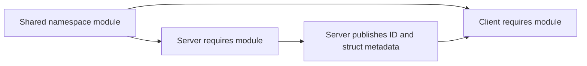

# Core concepts

## Namespace

A namespace groups related packets and queries. ByteNet Max assigns their numeric IDs on the server and shares the mapping with clients.

```lua
ByteNetMax.defineNamespace("Inventory", function()
	return {
		packets = { ... },
		queries = { ... },
	}
end)
```

Use one shared ModuleScript for each namespace. Give every namespace a stable, unique name.

## Packet

A packet sends data in one direction and does not produce a return value. Packets support:

- Client → server with `send`
- Server → one client with `sendTo`
- Server → a list with `sendToList`
- Server → everyone with `sendToAll`
- Server → everyone except one client with `sendToAllExcept`

## Query

A query sends a typed request from the client to the server and returns a typed response. It is ByteNet Max's request/response primitive.

## Data type

A ByteNet Max data type knows how to encode and decode a value. Schemas compose these types:

```lua
ByteNetMax.struct({
	Name = ByteNetMax.string,
	Level = ByteNetMax.uint16,
	Position = ByteNetMax.vec3,
	Nickname = ByteNetMax.optional(ByteNetMax.string),
})
```

Explicit types are usually smaller and clearer than `auto`.

## Shared initialization

The namespace definition must run on both the server and client, with the server initializing first. Sharing a single ModuleScript prevents the two sides from drifting apart. Follow the [required initialization guide](initialization.md) for the exact layout.



If a namespace contains packets, its callback must return a `packets` table. If it contains queries, it must return a `queries` table. Return both when the namespace uses both primitives.

## Server authority

Serialization checks the shape of network data; it does not make client input trustworthy. The server must still decide whether the requested action is valid.
